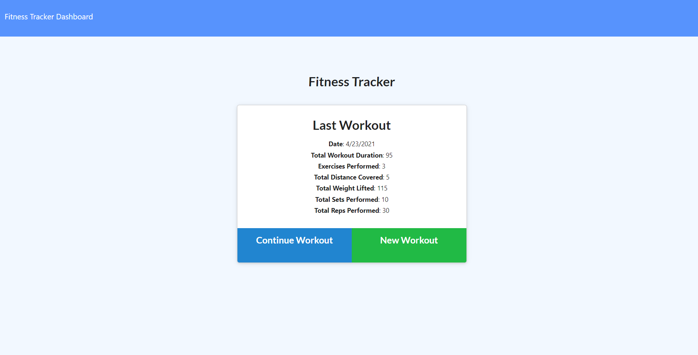

# Workout Tracker  

## Table of Contents
* [Video](#Video) 
* [Description](#Description)
* [Installation](#Installation) 
* [License](#license) 
* [Questions](#Questions)

## Video
Click [`here`](https://drive.google.com/file/d/1XUh5v05y4Ik2fKvq9e8w9iH3SyN-vjLD/view) to watch a full tutorial on video!

## Description

Want to keep up with your workouts each day? With this app, the user can track what exercises they have completed. Keep up with how many reps, the weight of the exercise, duration, how many sets were done, or the distance achieved. Working out has never been so easy! 

## Installation

For this application, you will need to first run npm i to install the dependencies which include express, mongoose for the server and morgan. Once the dependencies have been installed, run the seed package by typing in npm run seed in the terminal. Then the user will run npm run start to run the local server. 

## License

Copyright (c) 2021 Carlo Joshua Serame

Permission is hereby granted, free of charge, to any person obtaining a copy of this software and associated documentation files (the "Software"), to deal in the Software without restriction, including without limitation the rights to use, copy, modify, merge, publish, distribute, sublicense, and/or sell copies of the Software, and to permit persons to whom the Software is furnished to do so, subject to the following conditions:

The above copyright notice and this permission notice shall be included in all copies or substantial portions of the Software.

THE SOFTWARE IS PROVIDED "AS IS", WITHOUT WARRANTY OF ANY KIND, EXPRESS OR IMPLIED, INCLUDING BUT NOT LIMITED TO THE WARRANTIES OF MERCHANTABILITY, FITNESS FOR A PARTICULAR PURPOSE AND NONINFRINGEMENT. IN NO EVENT SHALL THE AUTHORS OR COPYRIGHT HOLDERS BE LIABLE FOR ANY CLAIM, DAMAGES OR OTHER LIABILITY, WHETHER IN AN ACTION OF CONTRACT, TORT OR OTHERWISE, ARISING FROM, OUT OF OR IN CONNECTION WITH THE SOFTWARE OR THE USE OR OTHER DEALINGS IN THE SOFTWARE.
  

## Questions?
  Questions? please contact me:
 
  GitHub: [CJSerame24](https://github.com/CJSerame24)
  
  Email: carloserame24@gmail.com